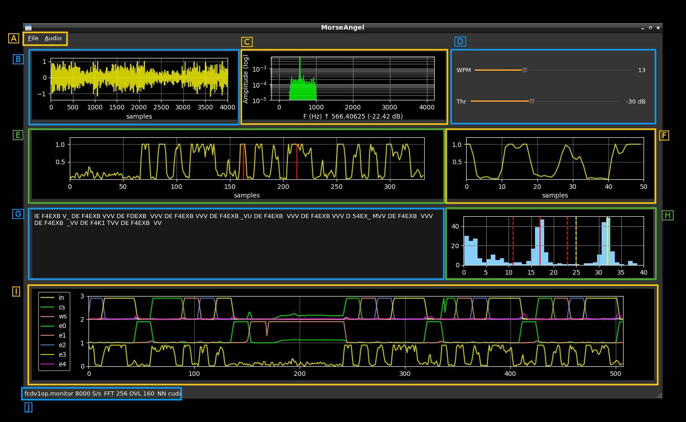
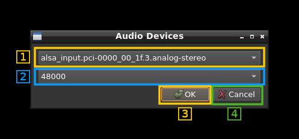
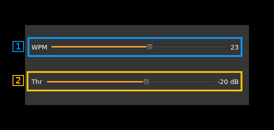

<h1>Deep Neural Networks for Morse decoding</h1>

This is a Python3 application Based on PyQt5 for the GUI and PyTorch for the Deep Neural Network. Its purpose is to decode Morse from the sound coming from an audio device.

At this stage the model (and thus the "program") is far from working satisfactorily. I cannot spend much more time on this since I already dedicated a lot of time to reach this point. However this is Open Source and contributors are welcome to continue the work, bring enhancements or take a different route to obtain better results. I hope the present materials can serve as a base.

Details on the Neural Network (NN) are given in paragraph H of the Usage section.

<h2>Contents</h2>

<h3>notebooks</h3>

This folder contains development Jupyter notebooks. It contains all notebooks from early stage to more elaborated models. The models are trained in the notebooks.

Please check the `readme.md` file in the `notebooks` folder for more information.

<h3>drafts</h3>

Some pure python drafts

<h3>main folder</h3>

This is the main application folder containing `morseangel.py` and its dependencies

<h2>Start</h2>

You will need Python3 and virtualenv installed in your system. Firstly create and activate a virtual environment:

```sh
virtualenv venv
. ./venv/bin/activate
```

Install prerequisites with pip:

```sh
pip install -r requirements.txt
```

Start application:

```sh
python ./morseangel.py
```

The Neural Network weights are taken from `models/default.model` you must make sure this file is present.

<h2>Usage<h2>



<h3>A: Top menu</h3>

<h4>File</h4>

Just contains the "Exit" item to quit application

<h4>Audio</h4>

The "Device" menu item opens a dialog to choose the Audio input. An audio input must be selected for the program to work.



  - **1**: Select input device
  - **2**: Select sample rate among available sample rates for device. As much as possible the 8000 S/s sample rate should be selected or the nearest value.
  - **3**: Confirm selection and close dialog
  - **4**: Cancel selection and close dialog

<h3>B: Audio input view</h3>

This time line display shows the amplitude of the audio signal

<h3>C: Spectrum peak detection</h3>

This is the output of the 16k FFT used to find the frequency of the signal peak. The detected peak frequency along with its magnitude in dB is displayed in the legend below the `x` axis

<h3>D: Controls</h3>



<h4>D.1: Set Words Per Minute (WPM)</h4>

Use this slider to adjust the Morse code speed in Words Per Minute. You can get help from the envelope signal zoom (F). Yhe optimal length for a dit is 7.69 so a dit should fit from its base in a 10 samples interval.

<h4>D.2: Threshold</h4>

Adjust the value in dB for peak detection.

<h3>E: Envelope view</h3>

This is the time line of the detected envelope. Envelope is obtained from the bin of FFT size shown in (I.3) where lies the peak detected by the peak detector (see C). The &plusmn;1 bins surrounding the peak bin are also considered (summed up).

The red bars delimit the zoomed view shown in F

<h3>F: Zoomed envelope</h3>

The part of envelope between the red bars in (E) is displayed here

<h3>G: Decoded text</h3>

The decoded text from Morse audio appears here

<h3>H: NN output view</h3>

This view displays the timeline of the Neural Network output. There are 7 timelines with the corresponding legend:

  - **in**: input signal
  - **cs**: character separator
  - **ws**: word separator
  - **e0**: first Morse element (dit or dah)
  - **e1**: second Morse element
  - **e2**: third Morse element
  - **e3**: fourth Morse element
  - **e4**: fifth Morse element

Morse characters are decomposed in their constituting elements (the "dits" and the "dahs") that is the "on" periods of the On Off Keying (OOK) signal. The purpose of the NN model is to classify these elements in order for each Morse character in their relative position from the start of the character. It has also (of course) to identify the periods of silence into character and word separators. It is not necessary and in fact detrimental to identify the silence between Morse elements. It is limited to 5 Morse elements that is alphanumeric characters plus a few special characters such as `+`, `/` and `=`

The NN model is based on a LSTM layer. In fact there are two LSTM layers stacked on top of each other (easy to do in PyTorch) and a final Dense (Linear in PyTorch's terms) layer. Thus it takes the imput samples as a stream with a "look back" period corresponding to the longest Morse character possible which is `0` since it is limited to 5 Morse elements. It regurgitates the 7 signals above as sample streams alse.

A final purely algorithmic stage does the decoding by identifying character and word breaks using the `cs` and `ws` "senses" and estimating the relative length of the "on" period on each `e#` element sense. Once the successive "dits" and "dahs" are identified a simple lookup table yields the displayable character that is appended to the decoded text.

Ideally a "dit" period should be represented by 7.69 samples corresponding to the training of the model. For now there is now other way to get close to this value than estimating the Morse code speed in Words Per Minute (WPM) manually. There is an "official" correspondance that states that the period of a "dit" in seconds is 1.2 &div; WPM.

The preprocessing extracts the envelope taking the FFT of the signal with an overlay. Knowing the Morse code speed in WPM the program can compute optimal parameters of FFT length and overlay length to reach 7.69 samples per dit. The FFT size and overlay are displayed in the status line (See next.)

<h3>I: status</h3>


  - **1**: Audio device selected
  - **2**: Sample rate in samples per second (S/s)
  - **3**: Envelope detection FFT size
  - **4**: Envelope detection FFT overlay
  - **5**: Device used for Neural Network inference. It can be `cuda` if Nvidia GPU can be used else `cpu`.

FFT size and overlay is automatically selected for optimal values depending on sample rate and Morse code speed (WPM).
